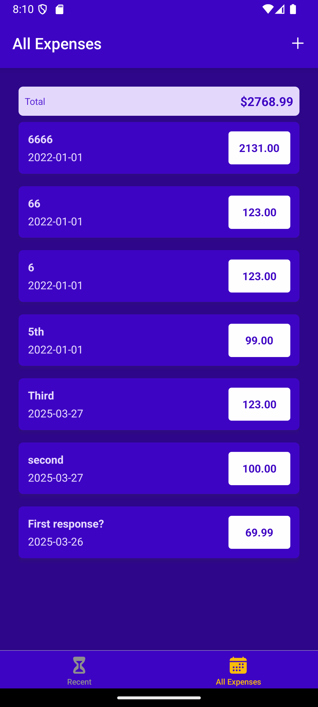

# react-native-expenses-app

An app for tracking expenses made by following the "React Native - The Practical Guide" Udemy course.

|                                                                     |                                                               |                                                             |                                                               |
| :-----------------------------------------------------------------: | :-----------------------------------------------------------: | :---------------------------------------------------------: | :-----------------------------------------------------------: |
|    **Recent Expenses Screen** |    **All Expenses Screen** |    **Add Expense Screen** |    **Edit Expense Screen** |
